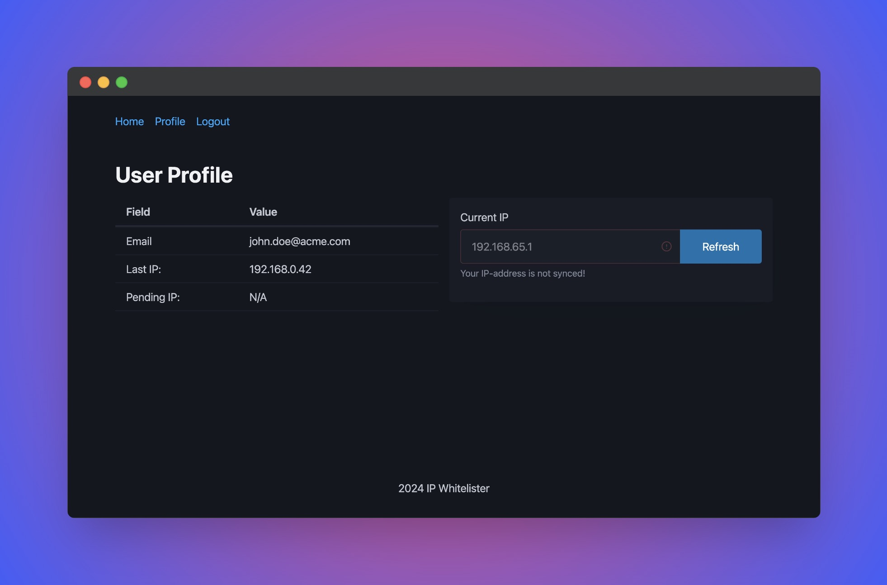

# ipwhitelister

A Go application to manage IP whitelisting using Cloudflare's Zone Lockdown feature.



Associate an IP address with an email, enabling users to update their IP address as needed. This functionality is particularly useful for users with dynamic IP addresses who require access to a website from various locations, eliminating the need for manual updates to the Zone Lockdown Rule.

For more complex use cases, consider using Cloudflare's Access feature (Zero Trust Network Access).

### Details

This web application is crafted with Go, featuring minimal external dependencies for a streamlined and efficient deployment. Key highlights:

- Built using Go with a single dependency on `github.com/mattn/go-sqlite3`.
- Leverages Go standard library packages such as `net/http` and `html/template` for serving web pages.
- It's being built into a single binary as it uses Go's `embed.FS` feature to embed static files at compile time.
- Modern UI is backed by [PicoCSS](https://picocss.com/) and [HTMX](https://htmx.org/) for a lightweight and responsive design.
- This app is dockerized using [distroless image](https://github.com/GoogleContainerTools/distroless) for minimal size (just 11MB).

### Features

This application is a web server that allows managing the IP addresses of Zone Lockdown Rule. It assumes you've already set up Cloudflare's Zone Lockdown feature and you have an API token with the necessary permissions.

It replaces associated IP addresses within a single rule which is defined by variables in `.env` file. See `.env.dist` for example.

Users are allowed to log in using their email and are authenticated by a token sent to their email. For sending emails, the application uses the `Mandrill` service.

Authenitcated user is represented by Profile, which is a structure that holds email, associated IP, and pending IP. The pending IP is used to store the new IP address that the user wants to associate with their profile. This allows to ensure reliable and robust process of changing IP addresses in case of network failure or other third-party issues.

Service gets an IP from HTTP-header defined in `.env` or fallbacks to RemoteAddr. Having an IP, the app does a lookup of the user's IP address in a Rule records and replaces it with the new one if last associated IP was found.

### Starting app using docker compose

Clone this repository and run the following command:

```bash
# create data directory with sqlite database
mkdir -p data
touch data/db.sqlite3

# create .env file and fill it with your values for variables
cp .env.dist .env

# start the app
docker compose up -d
```


### Importing initial data

While the application is running, you can import initial data using sqlite3 cli or another container. Create sql-file with initial data:

```sql
INSERT INTO profiles (email, associated_ip, pending_ip) VALUES 
  ('john.doe@acme.com', '192.168.0.1', ''),
  ('jane.doe@acme.com', '192.168.0.2', '')
;
```

Use sqlite on your host machine to import data. Alternatively, run separate container to import data (example below):

```bash
docker run -it -v ./data:/app/data alpine sh

# inside the container
apk add sqlite
sqlite3 /app/data/db.sqlite3 < import.sql
```

### Build your own docker image

If you want to build your own docker image to keep it in your desired container registry, you can use the following command:

```bash
# replace `build args` and `platform` with your values for desired OS and architecture
docker build . \
    -f Dockerfile \
    --tag ipwhitelister:latest \
    --build-arg TARGETOS=linux \
    --build-arg TARGETARCH=arm64 \
    --platform=linux/arm64 \
    --target=ipwhitelister
```

Then replace `build` section with `image` (or use `docker-compose.prod.yml` with your image name) and start the app.

```bash
docker compose up -d --file docker-compose.prod.yml
```
